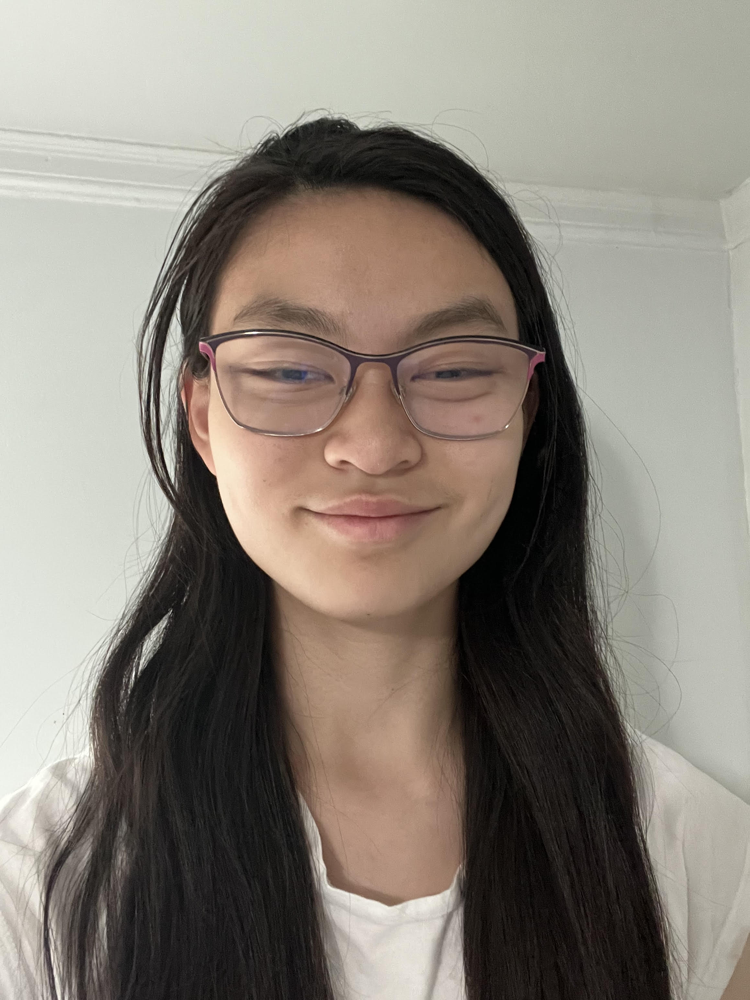
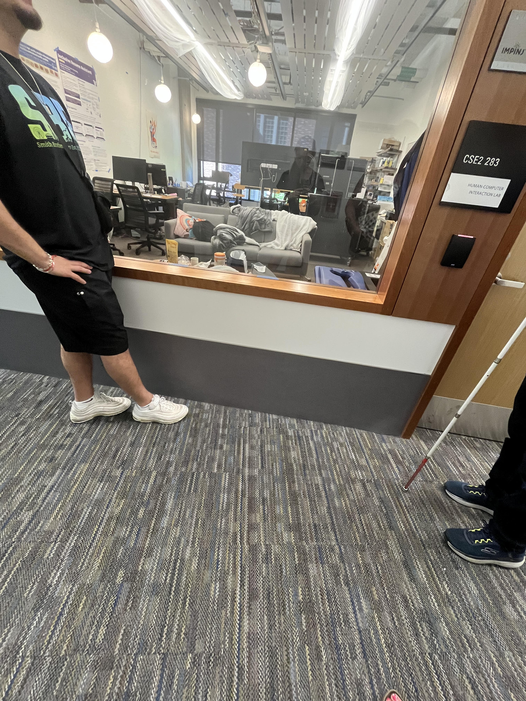
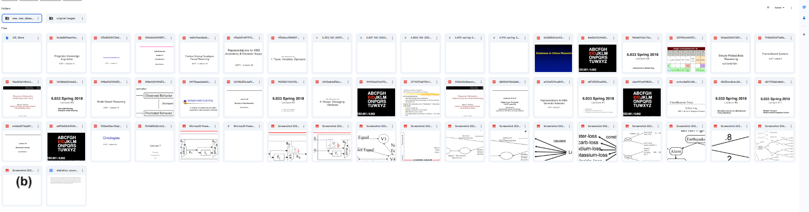

* TOC
{:toc}

## About Me

My name is Susanna Haley, and I am a high school sophomore interning at the CREATE (Center for Research and Education on Accessible Technology and Experiences.) Lab through the YES2 internship program at the University of Washington. YES2 stands for Youth Employment Solutions 2. This program helps low vision and blind students ages 16 to 21 gain job experience and become more independent. It is the second program in a series of two.During my internship, I worked alongside two other YES2 interns, Mohammad and Kaleb. Together, we helped three PhD students with their research projects. I specifically worked with Brianna Wimer on the Flowcharts Project. This project aims to make flowcharts more accessible for individuals with low vision or blindness by extracting and converting the flowchart information—such as nodes and arrows—into a list format that can be more easily accessed.

## Week 1

On the first day of my internship, I had the opportunity to meet my three mentors—Brianna, Adrian, and Carlos—in person at the CREATE Lab, located in the Bill and Melinda Gates Center for Computer Science & Engineering. The first week was an introductory week. It allowed us to get to know one another and to meet other PhD students and interns, such as Kajia, Kate, and Toby.
In the beginning, I started to learn Mermaid, a text-based tool used to create and visualize diagrams like flowcharts. Afterward, I transitioned to learning the basics of Flask, a lightweight Python framework for building web applications.

## Week 2

I looked over 32 PDFs, including additional PDFs in the zip files, and extracted a total of 342 images that looked like flowcharts. I organized this data into a Google Sheet, documenting details such as file name, PDF name, and lecture name. Next, I applied inclusion and exclusion criteria to narrow down the number of flowcharts that met the definition for the project. The inclusion criteria required flowcharts to have at least two nodes within a shape and at least one edge. The exclusion criteria eliminated flowcharts that were not in English, lacked visual clarity, or were duplicates.

## Week 3
I began learning how to use OpenAI’s API to automatically generate Mermaid code for the flowchart images, which would then allow me to visualize them more efficiently. OpenAI’s API (Application Programming Interface) is a tool that lets developers connect their code to OpenAI’s AI models. However, as I continued applying the inclusion and exclusion criteria, I began to struggle with recognizing which images were true flowcharts and which were not. Some images labeled as flowcharts did not meet the definition or characteristics of a flowchart, leading to confusion. To fix this, I revisited the images and created Mermaid code for each one to confirm that it was indeed a flowchart. This process helped me ensure accuracy but was time-consuming and required careful attention to detail. So i had to stop the OpenAi project I was doing. 

images
/Screenshot 2025-08-04 105640 (2).png
## Week 4
I further explored APIs and learned how to use ChatGPT-4o’s API. Chatgpt-4o is a different large language model version. I learned how to generate content based on prompts to Chatgpt4o. I began by having the AI generate random flowcharts. Then, I developed a program where users could input the number of nodes and edges, as well as the topic of the flowchart. The program has two buttons: "Generate Flowchart," which automatically produces the flowchart as an SVG image using AI, and "Handdrawn," which provides a list of nodes and descriptions, allowing users to manually assign node positions. SVG files, or Scalable Vector Graphics, are primarily used for creating and displaying two-dimensional graphics, especially on websites This feature helps include hand-drawn flowcharts into our dataset. Additionally, I collected statistics on the flowcharts, including the number of nodes, edges, and the variety of shapes used. I categorized these measurements into groups of fewer than 10 , between 10 and 19, and 20 or more nodes and edges.

